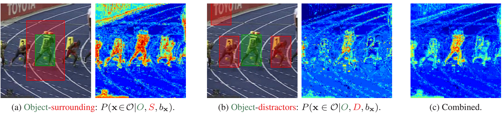
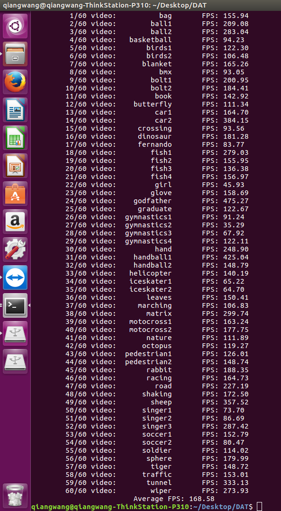

# DAT
This is a C++ reimplementation of algorithm presented in "In Defense of Color-based Model-free Tracking." .
Since the source code contains no multiscale module, we just retain distractor-aware object module which is rather fast.
For more info, visit the autor's [webpage](https://lrs.icg.tugraz.at/members/possegger)!.



##Usage

Simple test can be compiled like:
```
cmake
make
.\DAT test
```
For test the **[vot2015](http://votchallenge.net/vot2015/dataset.html)** challenge, please download the [dataset](http://box.vicos.si/vot/vot2015.zip) at first and then unzip to ${DAT}.
```
cmake
make
.\DAT vot2015
```

##Speed

Test in Windows with Intel i7-4790


Test in ubuntu 16.04 with Intel i7-6700



##Reference

```
@INPROCEEDINGS{possegger15a,
  author = {Horst Possegger and Thomas Mauthner and Horst Bischof},
  title = {In Defense of Color-based Model-free Tracking},
  booktitle = {Proc. IEEE Conference on Computer Vision and Pattern Recognition (CVPR)},
  year = {2015}
}
```
