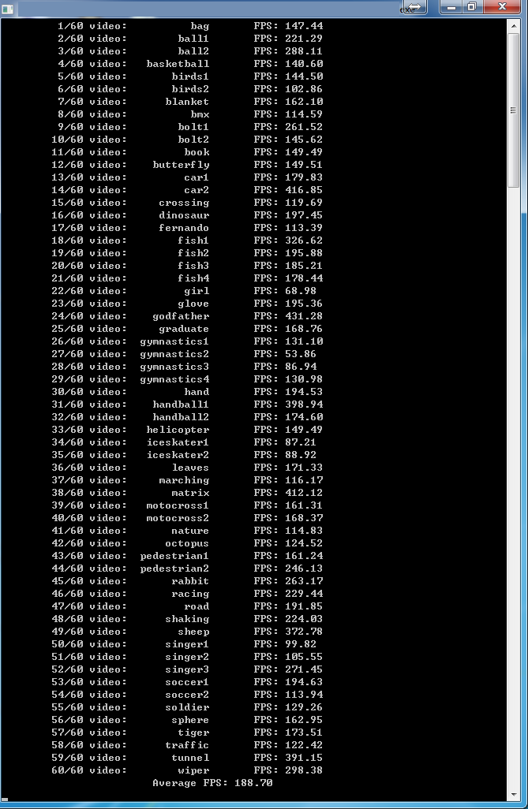

# DAT
This is a C++ reimplementation of algorithm presented in "In Defense of Color-based Model-free Tracking." .

For more info and implementation in other languages visit the autor's [webpage](https://lrs.icg.tugraz.at/members/possegger)!.


###speed


###Reference
```
@INPROCEEDINGS{possegger15a,
  author = {Horst Possegger and Thomas Mauthner and Horst Bischof},
  title = {In Defense of Color-based Model-free Tracking},
  booktitle = {Proc. IEEE Conference on Computer Vision and Pattern Recognition (CVPR)},
  year = {2015}
}
```